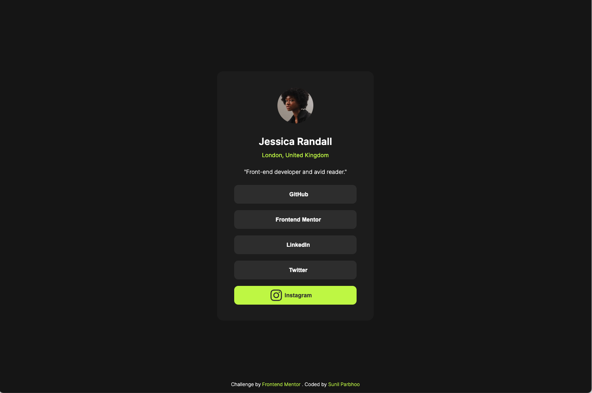

# Frontend Mentor - Social links profile solution

This is a solution to the [Social links profile challenge on Frontend Mentor](https://www.frontendmentor.io/challenges/social-links-profile-UG32l9m6dQ). Frontend Mentor challenges help you improve your coding skills by building realistic projects.

## Table of contents

- [Frontend Mentor - Social links profile solution](#frontend-mentor---social-links-profile-solution)
  - [Table of contents](#table-of-contents)
  - [Overview](#overview)
    - [The challenge](#the-challenge)
    - [Screenshot](#screenshot)
    - [Links](#links)
  - [My process](#my-process)
    - [Built with](#built-with)
    - [What I learned](#what-i-learned)
  - [Author](#author)

## Overview

### The challenge

Users should be able to:

- See hover and focus states for all interactive elements on the page

### Screenshot

### Links

- Solution URL: [Frontend Mentor Social Links Profile](https://www.frontendmentor.io/solutions/social-links-profile-FfBiUXw8qQ)
- Live Site URL: [Social Links Profile](https://sunilparbhoo.github.io/Frontend-Mentor-Social-Links-Profile/)

## My process

I recreated this Social Links Profile as closely as possible based off the jpg designs provided in the challenge. I approximated margin/padding height/width sizes by opening the jpg in Mac OSX preview window. This site was built to be responsive, and this challenge provided additional practice in recreating responsive designs.

### Built with

- Semantic HTML5 markup
- CSS custom properties
- Flexbox
- CSS transform and transitions for animated states

### What I learned

I enjoyed recreating this challenge. I found it tricky to get things lined up just right per the design pictures (without the use of figma files this time), however I am happy with this attempt. I also tried utilizing transitions and transforms to customize and differentiate my code from the challenge, while sticking closely to the design.

## Author

- GitHub - [Sunil Parbhoo](https://www.your-site.com)
- Frontend Mentor - [@sunilparbhoo](https://www.frontendmentor.io/profile/sunilparbhoo)
